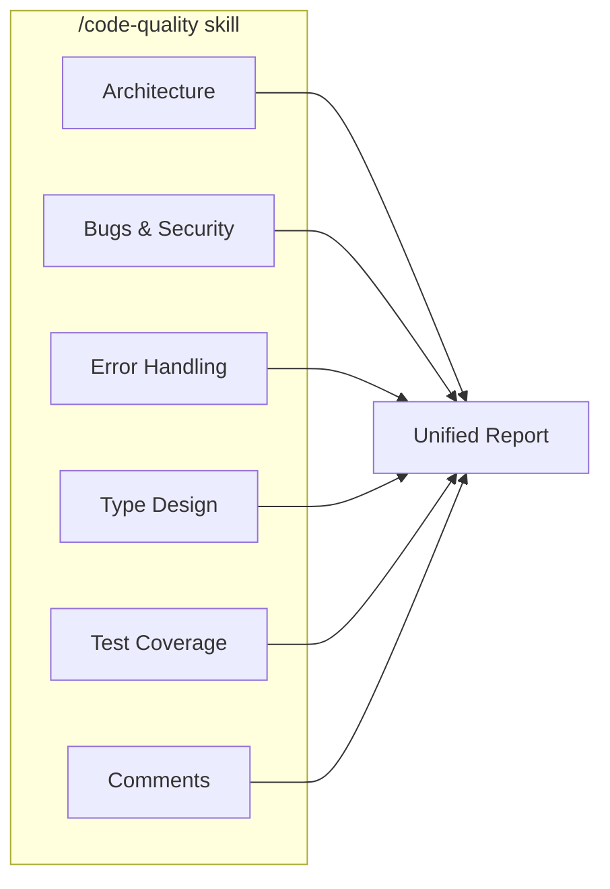
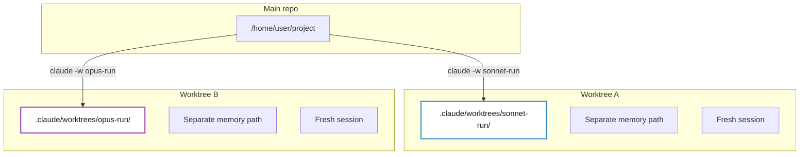
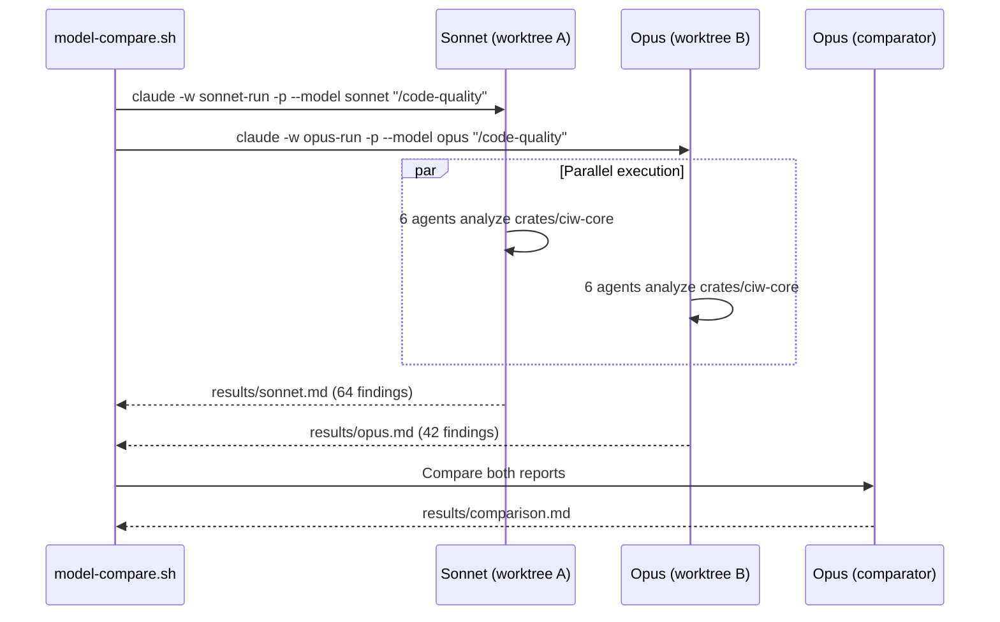
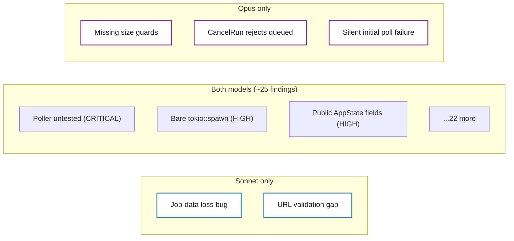
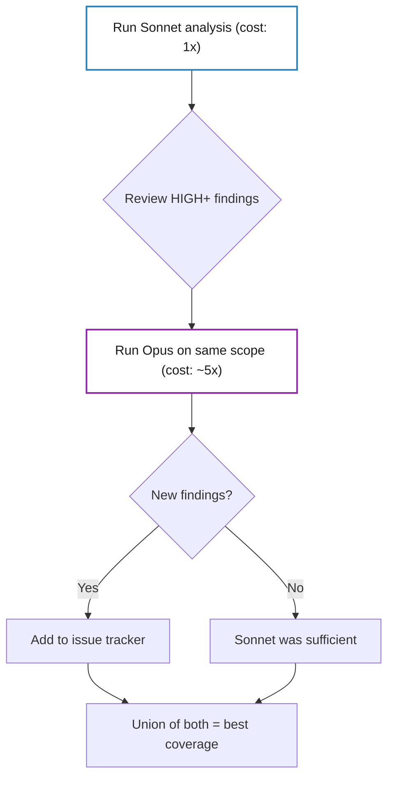

There's a question that keeps popping up in every team using AI for code review: is the expensive model worth it? Opus costs roughly 5x what Sonnet does. For code generation, you can feel the difference. But for code *analysis*, for catching bugs, spotting architectural debt, and flagging security gaps, does paying more actually surface better findings?

I decided to find out the hard way. I ran both models against the same codebase, in complete isolation, and compared what each one caught. The result wasn't what I expected.

## The experiment setup

The subject is [CI Watcher](https://github.com/opos/watch-gh-actions), a Rust terminal UI for monitoring GitHub Actions and GitLab CI pipelines. About 5,000 lines of async Rust spread across three crates, with a shared library (`ciw-core`) that handles the event loop, TUI rendering, polling, and change detection.

The analysis tool is a custom Claude Code skill called `/code-quality`. It spawns six specialized agents in parallel, each focused on a different dimension of the code:

Each agent reads the same source files independently. Then an orchestrator deduplicates and merges the findings into a single prioritized report. Think of it as a code review panel where six specialists examine the code, then a senior engineer reconciles their notes.

## The contamination problem

The critical requirement was zero interference between models. If Sonnet runs first and the session writes a memory file, Opus picks it up. If they share conversation context, the orchestrator's pattern-matching from run 1 leaks into run 2. Even a shared working directory means one process could write a temp file the other reads.

I needed two completely independent analysis sessions running the same prompt against the same code, with no shared state whatsoever.

Git worktrees turned out to be the answer. Claude Code has a `-w` flag that creates a [worktree](https://git-scm.com/docs/git-worktree), an isolated copy of the repository with its own working directory and its own auto-memory path. Combined with `--no-session-persistence` and `-p` (non-interactive, print-and-exit), each invocation becomes a hermetically sealed analysis:

Each worktree resolves to a different absolute path, so Claude Code's auto-memory (which is scoped by project path) gives each model a completely separate memory namespace. No shared conversation, no shared memory, no shared working directory.

I considered two alternatives and ditched both. Using `/clear` between runs resets conversation history but auto-memory persists. Running two `claude -p` invocations without worktrees is better, but both share the same working directory and memory path. Worktrees eliminate any possible leak.

The whole experiment fits in a 40-line bash script. Both models run in parallel, then a third Opus session compares the two reports:

## The numbers

Both models completed their analysis. Here's what came back:

| Metric | Sonnet | Opus |
|--------|--------|------|
| Total findings | 64 | 42 |
| Critical | 2 | 2 |
| High | 14 | 10 |
| Medium | 24 | 16 |
| Low | 24 | 14 |
| False positive rate | ~14% | ~4% |

The raw totals are misleading. Sonnet's higher count is mostly driven by more LOW-severity findings: redundant comment flags, test gaps for trivial code paths, performance concerns that the model itself calls "benign at current scale." Opus applies heavier deduplication and a higher bar for inclusion.

The real comparison is in the HIGH+ tier.

## Where they agree

Both models independently converged on about 25 findings at the same file and line number. This is the most interesting result: two completely independent analyses, with different internal weights and reasoning, arriving at the same structural problems.

When two independent reviewers flag the same line with the same severity, that's a strong validation signal. Those findings are real.

## Where they diverge

This is where things get interesting. Each model found real, HIGH-severity bugs that the other missed entirely.

Opus caught missing size guards before JSON parsing in `poller.rs`, where the project's own error-handling rules mandate calling `check_response_size()` before any `serde_json::from_str()`. This prevents an adversarial API response from OOMing the process. Sonnet didn't notice. Opus also found that the `CancelRun` handler incorrectly rejects queued runs, even though GitHub's API accepts cancellation of queued runs. That's a functional bug that maps directly to a support ticket. And it flagged a silent initial poll failure: the first poll error gives no user feedback, even though subsequent failures show a toast via the retry path.

Sonnet, on the other hand, landed the single most impactful finding across both reports. Because `jobs` is `#[serde(skip)]`, parsed runs always arrive with `jobs: None`, and the `update_runs` method does a full replace that silently wipes previously-fetched job lists. Expanded runs flicker and re-fetch on every poll cycle. A real, user-visible bug. Sonnet also caught that a URL from the API gets passed to the browser without HTTP scheme validation, violating the project's security rules.

Here's the pattern that emerges. Sonnet's unique finds lean toward data-flow correctness: it traces how values propagate through the system and catches cases where state is silently corrupted or lost. Opus's unique finds lean toward API-contract correctness: it checks whether code behavior matches what external systems actually accept, and whether internal rules are consistently applied.

Neither blind spot is "better." They're orthogonal.

## Severity calibration

In 9 cases where both models flagged the same issue but disagreed on severity, the comparison judge (a third Opus session) sided with Opus 8 out of 9 times.

The pattern is clear: Sonnet inflates comment and documentation findings to HIGH while underrating error-handling and architecture issues. Opus rates comment nits as MEDIUM or LOW and reserves HIGH for things that affect runtime behavior.

This is the data point that reframes the whole conversation. It's not just about which model finds more bugs. It's about how they calibrate severity, and that calibration matters just as much as detection.

## The workflow that works

The obvious question is whether Opus is worth 5x the cost. For a single run, no. Both models catch the same CRITICAL issues and roughly 80% of the same HIGHs. Opus has better precision and calibration, but the coverage overlap is substantial. If you're budget-constrained, Sonnet gives you most of the value.

But that's the wrong question. The real value isn't in picking one or the other. It's in running both. Each model catches 2-3 real HIGH bugs the other misses. The union of both reports is meaningfully stronger than either alone.

Sonnet first, broad and cheap, to capture most issues. Opus second, focused on the HIGH+ tier where its precision and unique catches justify the premium. And the comparison between both as a final step, because the disagreements between models are precisely where the most interesting bugs hide.

The total cost is about 6x a single Sonnet run. The total coverage is substantially better than either model alone. And the disagreements themselves are a signal: if two independent reviewers rate the same issue differently, that disagreement is worth digging into regardless of who's right.

The models have different eyes. Use both.

*This article is part of the "Experiments" series on [Prompt Lúcido](https://prompt-lucido.com). New article every week.*
