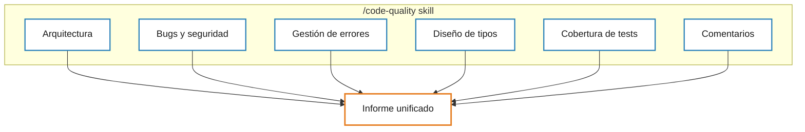
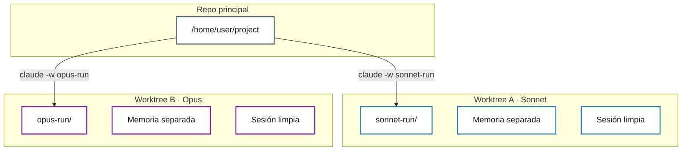
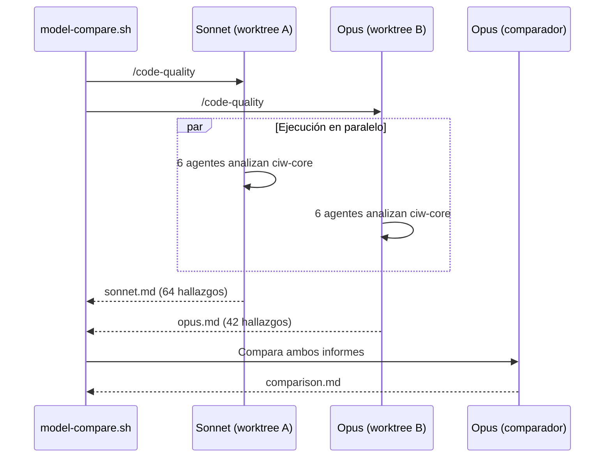
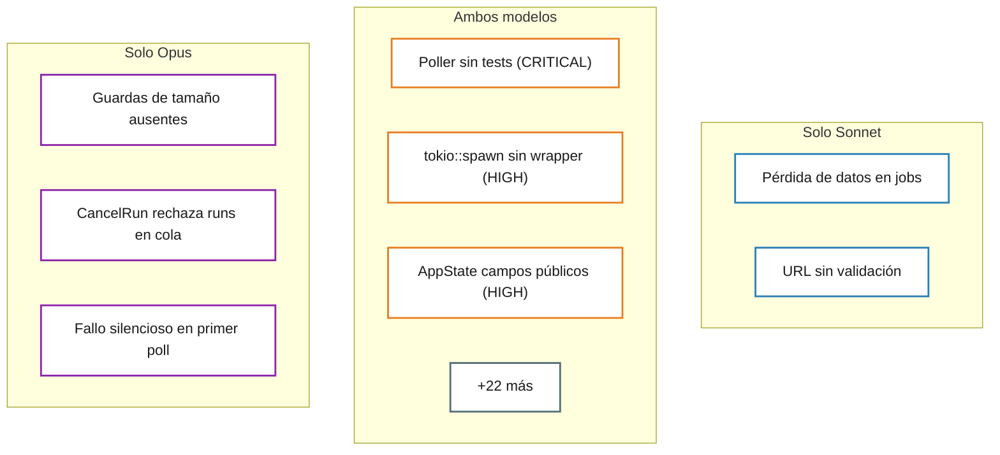
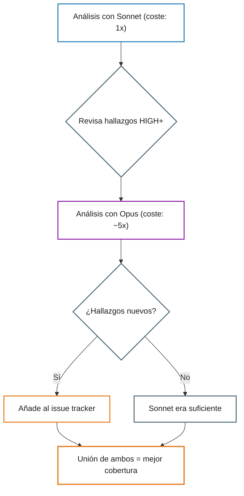

Hay una pregunta que aparece en todos los equipos que usan IA para revisar código: ¿merece la pena el modelo caro? Opus cuesta aproximadamente cinco veces más que Sonnet. Para generar código, la diferencia se nota. Pero para *analizar* código, para encontrar bugs, detectar deuda técnica o señalar fallos de seguridad, ¿pagar más realmente te da mejores resultados?

Decidí averiguarlo de forma empírica. Puse a dos modelos a revisar el mismo codebase, en completo aislamiento, y comparé lo que encontró cada uno. El resultado no fue el que esperaba.

## El montaje del experimento

El sujeto de análisis es [CI Watcher](https://github.com/opos/watch-gh-actions), una TUI en Rust para monitorizar pipelines de GitHub Actions y GitLab CI. Unas 5.000 líneas de Rust asíncrono repartidas en tres crates, con una librería compartida (`ciw-core`) que gestiona el event loop, el renderizado, el polling y la detección de cambios.

La herramienta de análisis es un skill personalizado de Claude Code llamado `/code-quality`. Lanza seis agentes en paralelo, cada uno enfocado en una dimensión distinta del código:

Cada agente lee los mismos archivos de forma independiente. Después, un orquestador deduplica y fusiona los hallazgos en un informe priorizado. Piensa en ello como un panel de revisión donde seis especialistas examinan el código y luego un ingeniero senior reconcilia sus notas.

## El problema de la contaminación

El requisito crítico era cero interferencia entre modelos. Si Sonnet se ejecuta primero y la sesión escribe un archivo de memoria, Opus lo lee. Si comparten contexto de conversación, los patrones del primer análisis se filtran al segundo. Incluso un directorio de trabajo compartido significa que un proceso puede escribir un archivo temporal que el otro recoja.

Necesitaba dos sesiones de análisis completamente independientes ejecutando el mismo prompt contra el mismo código, sin estado compartido de ningún tipo.

La solución fueron los git worktrees. Claude Code tiene un flag `-w` que crea un [worktree](https://git-scm.com/docs/git-worktree), una copia aislada del repositorio con su propio directorio de trabajo y su propia ruta de auto-memory. Combinado con `--no-session-persistence` y `-p` (no interactivo), cada invocación se convierte en un análisis herméticamente sellado:

Cada worktree resuelve a una ruta absoluta distinta, así que la auto-memory de Claude Code (que se vincula a la ruta del proyecto) le da a cada modelo un namespace de memoria completamente separado. Sin conversación compartida, sin memoria compartida, sin directorio de trabajo compartido.

Consideré dos alternativas y las descarté. Usar `/clear` entre ejecuciones resetea el historial de conversación, pero la auto-memory persiste. Ejecutar dos invocaciones `claude -p` sin worktrees es mejor, pero ambas comparten el mismo directorio de trabajo y ruta de memoria. Los worktrees eliminan cualquier fuga posible.

El experimento completo cabe en un script de bash de 40 líneas. Se ejecutan ambos modelos en paralelo, y después una tercera sesión de Opus compara los dos informes:

## Los números

Ambos modelos completaron su análisis. Esto es lo que encontraron:

| Métrica | Sonnet | Opus |
|---------|--------|------|
| Hallazgos totales | 64 | 42 |
| Críticos | 2 | 2 |
| High | 14 | 10 |
| Medium | 24 | 16 |
| Low | 24 | 14 |
| Tasa de falsos positivos | ~14% | ~4% |

Los totales en bruto engañan. El número más alto de Sonnet viene sobre todo de más hallazgos LOW: flags redundantes en comentarios, gaps de tests para rutas triviales, preocupaciones de rendimiento que el propio modelo califica como "benignas a la escala actual". Opus aplica una deduplicación más agresiva y un umbral de inclusión más alto.

La comparación real está en el nivel HIGH+.

## Donde coinciden

Ambos modelos convergieron de forma independiente en unos 25 hallazgos en el mismo archivo y la misma línea. Este es el resultado más interesante: dos análisis completamente independientes, con pesos internos y razonamiento distintos, llegando a los mismos problemas estructurales.

Cuando dos revisores independientes señalan la misma línea con la misma severidad, eso es una señal de validación fuerte. Esos hallazgos son reales.

## Donde divergen

Aquí es donde la cosa se pone interesante. Cada modelo encontró bugs reales de severidad HIGH que el otro ignoró por completo.

Opus detectó guardas de tamaño ausentes antes del parsing de JSON en `poller.rs`, donde las propias reglas del proyecto exigen llamar a `check_response_size()` antes de cualquier `serde_json::from_str()`. Esto previene que una respuesta adversarial de la API provoque un OOM. Sonnet no lo vio. Opus también encontró que el handler de `CancelRun` rechaza incorrectamente runs en cola, cuando la API de GitHub sí permite cancelarlos. Es decir, un bug funcional que se traduce directamente en un ticket de soporte. Y señaló un fallo silencioso en el primer poll: un error inicial no da feedback al usuario, aunque los errores posteriores sí muestran un toast.

Sonnet, por su parte, encontró el hallazgo individual más impactante de ambos informes: como el campo `jobs` tiene `#[serde(skip)]`, los runs parseados siempre llegan con `jobs: None`, y el método `update_runs` hace un reemplazo completo que borra silenciosamente las listas de jobs previamente cargadas. Los runs expandidos parpadean y se recargan en cada ciclo de polling. Un bug real, visible para el usuario. También detectó que una URL de la API se pasa al navegador sin validación de esquema HTTP, contraviniendo las reglas de seguridad del proyecto.

Aquí emerge el patrón. Los hallazgos únicos de Sonnet se inclinan hacia la corrección del flujo de datos: rastrea cómo los valores se propagan por el sistema y detecta casos donde el estado se corrompe o se pierde silenciosamente. Los hallazgos únicos de Opus se inclinan hacia la corrección de contratos con APIs: verifica si el comportamiento del código coincide con lo que los sistemas externos realmente aceptan, y si las reglas internas se aplican de forma consistente.

Ningún punto ciego es "mejor". Son ortogonales.

## La calibración de severidad

En 9 casos donde ambos modelos señalaron el mismo problema pero discreparon en severidad, el juez comparador (una tercera sesión de Opus) le dio la razón a Opus 8 de 9 veces.

El patrón es claro: Sonnet infla la severidad de hallazgos de comentarios y documentación a HIGH, mientras subestima problemas de gestión de errores y arquitectura. Opus califica los nits de comentarios como MEDIUM o LOW y reserva HIGH para lo que afecta al comportamiento en tiempo de ejecución.

Este dato es el que reencuadra toda la conversación. No se trata solo de que un modelo encuentre más o menos bugs. Se trata de que calibran la gravedad de forma distinta, y esa calibración importa tanto como la detección.

## El flujo de trabajo que funciona

La pregunta obvia es si Opus vale cinco veces más. Para una sola ejecución, no. Ambos modelos detectan los mismos problemas CRITICAL y aproximadamente el 80% de los mismos HIGH. Opus tiene mejor precisión y calibración, pero la cobertura se solapa bastante. Si tu presupuesto es limitado, Sonnet te da la mayor parte del valor.

Pero esa no es la pregunta correcta. El valor real no está en elegir uno u otro, sino en usar los dos. Cada modelo detecta 2-3 bugs HIGH reales que el otro ignora. La unión de ambos informes es significativamente más fuerte que cualquiera por separado.

Sonnet primero, amplio y barato, para capturar la mayoría de problemas. Opus después, enfocado en el nivel HIGH+ donde su precisión y sus hallazgos únicos justifican el premium. Y la comparación entre ambos como paso final, porque los desacuerdos entre modelos son precisamente donde se esconden los bugs más interesantes.

El coste total es unas seis veces una ejecución de Sonnet. La cobertura total es sustancialmente mejor que cualquier modelo solo. Y los desacuerdos en sí mismos son una señal: si dos revisores independientes califican el mismo problema de forma distinta, ese desacuerdo merece investigación independientemente de quién tenga razón.

Los modelos tienen ojos distintos. Usa los dos.

*Este artículo es parte de la serie "Experimentos" en [Prompt Lúcido](https://prompt-lucido.com). Nuevo artículo cada semana.*
